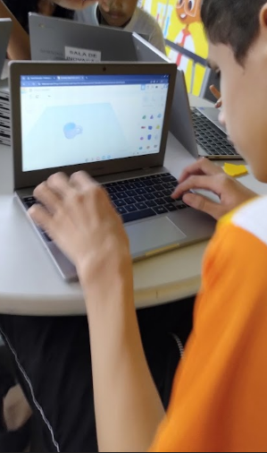

# 🎓 Ferramentas de Informática Educativa  
## Aplicações na Educação Básica

 
 
 

> Por Abraão Alves

---

# Contexto

## EMEIF João Estanislau Façanha

---

# 🧩 I. Ferramentas 

---

  

### 🔧 Tinkercad <!-- fit -->

  

  

  <b>Descrição e Potencial Educativo</b>
  

  Plataforma gratuita da Autodesk para design 3D, simulação de circuitos e programação com blocos. Ideal para robótica educacional e ensino interdisciplinar (STEM). Estimula pensamento crítico, criatividade e resolução de problemas.

  

  

 
---

  

### 🔧 Tinkercad <!-- fit -->

  

  

## Ação Educativa Sugerida

<b>Projeto Maker Interdisciplinar</b>

  Alunos do Ensino Médio projetam e simulam um circuito de semáforo inteligente com Arduino, integrando Física e Tecnologia.

  

---

### 💻 Replit <!-- fit-->

<b>Descrição e Potencial Educativo</b> 
Plataforma online para programação em linguagens como Python, JavaScript e HTML. Estimula competências digitais, resolução de problemas e trabalho em equipe.

---

### 💻 Replit <!-- fit-->

<b>Ação Educativa Sugerida</b> 
<b>Clube de Programação e Lógica</b> 
Alunos, em duplas, desenvolvem um jogo de adivinhação em Python, praticando algoritmos e lógica computacional com colaboração em tempo real.

---

# 🎮 II. Ferramenta Criada em conjunto

---

  

### 🐦 Birds no Grau <!-- fit -->

> link: https://kilviasantos.github.io/BirdsNoGrau/

  

  

    <b>Descrição e Potencial Educativo</b>   
    Jogo digital em HTML, CSS e JavaScript que simula a trajetória de uma função quadrática. Permite inserção de coeficientes e visualização da parábola em tempo real. Utiliza gamificação e aprendizagem por descoberta.
  

---

  

### 🐦 Birds no Grau <!-- fit -->

> link: https://kilviasantos.github.io/BirdsNoGrau/

  

  

<b> Ação Educativa Sugerida</b>
<b>Desafio do Coeficiente</b>   

  

    Na lousa digital, o professor propõe que os alunos ajustem os coeficientes a, b e c para acertar um alvo. A atividade proporciona feedback visual imediato e compreensão intuitiva da função quadrática.
  

    
  

---

## Bibliografia

- TinkerCad: https://www.tinkercad.com/
- Replit: https://replit.com/
- BirdsNoGrau: https://kilviasantos.github.io/BirdsNoGrau/
