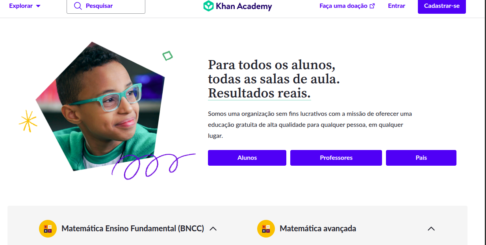
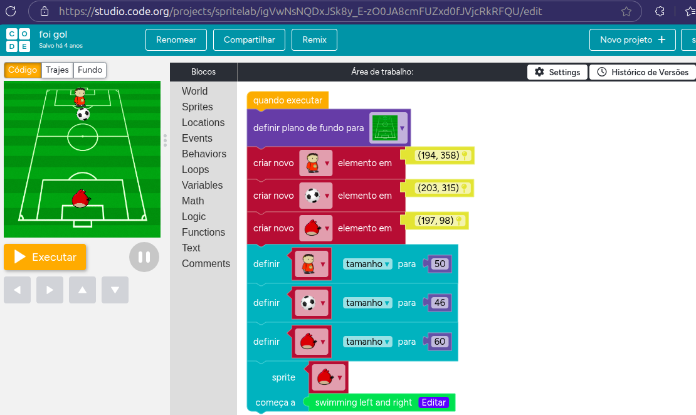
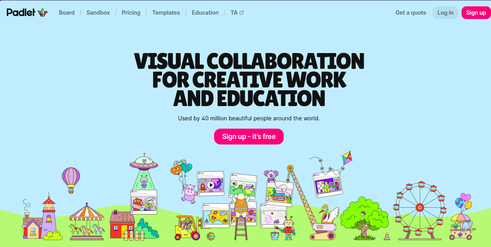
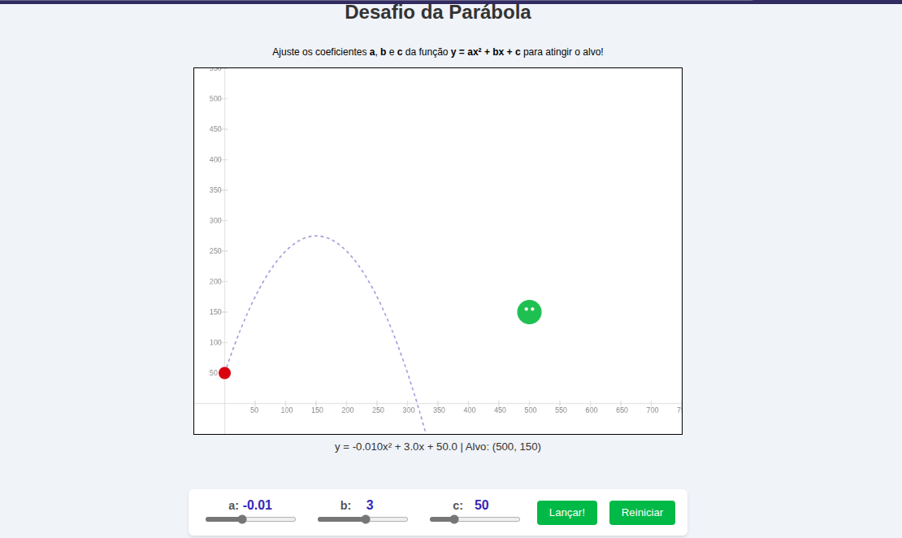

# 🎓 Ferramentas de Informática Educativa  
## Aplicações na Educação Básica

 
 
 

> Por Kilvia Santos

---

# 🎯 Objetivo da Apresentação

Apresentar **ferramentas digitais com potencial educativo** para aplicação em sala de aula, destacando os seguintes aspectos:

 

- **Facilidade de uso**  
  <!-- Avaliar a acessibilidade, a interface e os recursos disponíveis para alunos e professores. -->

- **Potencial pedagógico**  
  <!-- Explorar como cada ferramenta contribui para o desenvolvimento de competências cognitivas, digitais e socioemocionais. -->

- **Proposta de ação educativa**  
  <!-- Sugerir atividades práticas e contextualizadas que podem ser realizadas em sala de aula utilizando cada ferramenta. -->

---

# Contexto

## Jim Wilson

---

# 📚 I. Ferramentas

---

  

### 🧠 Khan Academy <!-- fit -->

 

  

  

    <b>Descrição e Potencial Educativo</b> 
    Plataforma gratuita com conteúdos em diversas áreas, com trilhas organizadas por nível. Promove autonomia, raciocínio lógico e aprendizado progressivo.
  

---

  

### 🧠 Khan Academy <!-- fit -->

 

  

  

    <b>Ação Educativa Sugerida</b> 
    <b>Reforço e Aceleração Individualizada</b> 
    O professor propõe trilhas de exercícios para revisão ou avanço em Matemática, permitindo que cada aluno progrida no seu ritmo.
  

---

  

### 🧩 Code.org <!-- fit -->

 

  

  

    <b>Descrição e Potencial Educativo</b> 
    Plataforma gratuita para ensino de programação e pensamento computacional. Utiliza blocos visuais e JavaScript. Estimula criatividade, lógica e colaboração.
  

---

  

### 🧩 Code.org <!-- fit -->

 

  

  

    <b>Ação Educativa Sugerida</b> 
    <b>Hora do Código</b> 
    Alunos do Ensino Fundamental programam a movimentação de personagens em desafios visuais, desenvolvendo pensamento algorítmico de forma lúdica.
  

---

  

### 🧵 Padlet <!-- fit -->

 

  

  

    <b>Descrição e Potencial Educativo</b> 
    Ferramenta colaborativa para criação de murais digitais com textos, imagens e vídeos. Favorece construção coletiva do conhecimento e competências socioemocionais.
  

---

  

### 🧵 Padlet <!-- fit -->

 

  

  

    <b>Ação Educativa Sugerida</b> 
    <b>Mural Colaborativo de Análise Literária</b> 
    Após a leitura de um livro, alunos do Ensino Médio compartilham interpretações, citações e imagens em um Padlet, estimulando argumentação e comunicação.
  

---

# 🎮 II. Ferramenta Criada em conjunto

---

  

### 🐦 Birds no Grau <!-- fit -->

> link: https://kilviasantos.github.io/BirdsNoGrau/

  

  

    <b>Descrição e Potencial Educativo</b>  
    Jogo digital em HTML, CSS e JavaScript que simula a trajetória de uma função quadrática. Permite inserção de coeficientes e visualização da parábola em tempo real. Utiliza gamificação e aprendizagem por descoberta.
  

---

  

### 🐦 Birds no Grau <!-- fit -->

> link: https://kilviasantos.github.io/BirdsNoGrau/

  

  

    <b>Ação Educativa Sugerida</b> 
    <b>Desafio do Coeficiente</b>  
    Na lousa digital, o professor propõe que os alunos ajustem os coeficientes a, b e c para acertar um alvo. A atividade proporciona feedback visual imediato e compreensão intuitiva da função quadrática.
  

--- 

# ✅ Conclusão

As ferramentas apresentadas promovem:

- **Aprendizagem ativa**  
<!--  Os alunos se tornam protagonistas do processo de ensino, explorando, criando e resolvendo problemas.
-->
- **Inclusão digital**  
<!--   O uso de plataformas acessíveis amplia o acesso à tecnologia e reduz desigualdades educacionais.
-->
- **Desenvolvimento de competências da BNCC**  
<!--  As atividades propostas estão alinhadas às competências gerais, como pensamento científico, cultura digital, comunicação e colaboração.
-->

**A integração dessas tecnologias potencializa o engajamento e a autonomia dos alunos**
<!-- , tornando o 
ambiente escolar mais dinâmico, inclusivo e conectado com os desafios do século XXI. -->

---

## Bibliografia

- Khan Academy: https://pt.khanacademy.org/
- Code.org: https://www.code.org/
- Padlet: https://padlet.com/
- BirdsNoGrau: https://kilviasantos.github.io/BirdsNoGrau/
